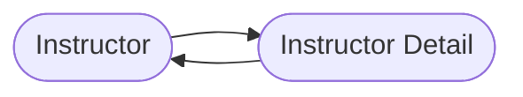

## Hibernate Mapping - oneToOne Bi-Directional



### Development Process: One-to-One (Bi-Directional)
1. Make updates to InstructorDetails class:
   1. Add  new fields to reference Instructor.
   2. Add getter/setter methods for Instructor.
   3. Add @OneToOne annotation
    ```java
    import entity.Instructor;
    
    import javax.persistence.CascadeType;import javax.persistence.Entity;
    import javax.persistence.OneToOne;
    import javax.persistence.Table;
    
    @Entity
    @Table(name = "instructor_detail")
    public class InstructorDetail {
      //...
      @OneToOne(mappedBy = "instructorDetail", cascade = CascadeType.ALL)
      private Instructor instructor;
      
      public Instructor getInstructor(){
          return instructor;
      }
      
      public void setInstructor(Instructor instructor){
          this.instructor  = instructor;
      }
    }
    //...
    ```
   ```
   public class Instructor{
        //...
        @OneToOne(cascade=CascadeType.ALL)
        @JoinColumn(name="instructor_detail_id")
        private InstructorDetail instructorDetail;
   ```
2. Create Main App
```
public static void main(){
  //..
  //get the instructor detail object
  int theId = 1;
  InstructorDetail tempInstructorDetail = session.get(InstructorDetail.class, theId);
  
  // print detail
  System.out.println("tempInstructorDetail: "+tempInstructorDetail);
  
  //print the associated instructor
  System.out.println("the Associated instructor:"+ tempInstructorDetail.getInstructor() );
}
```

### Mapped By
- mappedBy tell hibernate
  - Look at the instructorDetail property in the Instructor class
  - Use Information from the instructor class @JoinColumn
  - To help find associated instructor

### Delete Only one side (InstructorDetail)
Step 1: change cascade type, dont include REMOVE
```
cascade = {CascadeType.DETACH, CascadeType.MERGE, CascadeType.PERSIST, CascadeType.REFRESH} 
```

Step 2: break the bi directional link
```
tempInstructorDetail.getInstructor().setInstructorDetail(null);
```