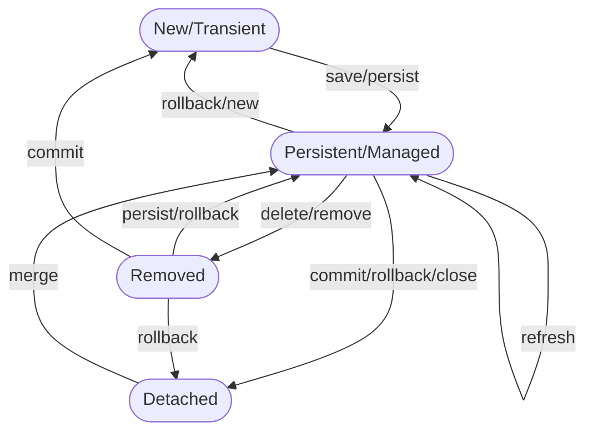
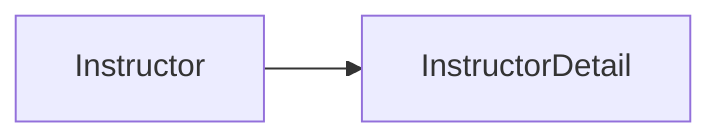

## Hibernate Mapping

### Type of Mapping
1. One to One
2. One to Many, Many to One
3. Many to Many

### Database Concept
####  1. Primary Key and Foreign Key
- Primary Key: identify a unique row in a table
- Foreign key: 
  - Link Table Together
  - a field in 1 table refer to primary key in another table

#### 2. Cascade
- Apply same operation to related entities

#### 3. Fetch Type
- Eager - when fetch data, it will retrieve everything
- Lazy - when fetch data, it will retrieve on request

#### 4. Directional
1. Uni-Directional
2. Bi-Directional

### Entity Lifecycle
| Operations | Description                                                                     |
|------------|---------------------------------------------------------------------------------|
| Detach     | If entiy is attached, it is not associated with Hibernate session               |
| Merge      | if Instances is detached from session,the merge will reattach to the session    |
| Persist    | Transitions new instances to managed state. Next flush/commit will save in db   |
| Remove     | Transitions managed entity to be removed. Next flush/commit will delete from db |
| Refresh    | Reload / synch object with data from db. Prevents stale data.                   |



### One-to-One (Uni-Directional)
#### 1. Development process 
STEP 1: Define Database Tables
STEP 2:Create InstructorDetails class

```java
import javax.persistence.*;

@Entity
@Table(name = "instructor_detail")
public class InstructorDetail {

  @Id
  @GeneratedValue(strategy = GenerationType.IDENTITY)
  @Column(name = "id")
  private int id;
  
  @Column(name = "youtube_channel")
  private String youtubeChannel;
  
  @Column(name = "hobby")
  private String hobby;
}
```
STEP 3: Create Instructor class

```java
import javax.persistence.*;

@Entity
@Table(name = "instructor")
public class Instructor {

  @Id
  @GeneratedValue(strategy = GenerationType.IDENTITY)
  @Column(name = "id")
  private int id;
  
  @Column(name = "first_name")
  private String firstName;

  @Column(name = "last_name")
  private String lastName;

  @Column(name = "email")
  private String email;
}
```
```java
import javax.persistence.*;

@Entity
@Table(name = "instructor")
public class Instructor {
    //...
    
  @OneToOne
  @JoinColumn(name = "instructor_detail_id")
  private InstructorDetail instructorDetail;
    //...
}
```
Uni-Direction one to one


STEP 4: CREATE MAIN APP

```java
public static void main(String[]args){
    //create the Object
        Instructor tempInstructor = new Instructor("Chad", "Darby", "darby@luv2code.com");
        
        InstructorDetail tempInstructorDetail = 
            new InstructorDetail("http://www.luv2code.com/youtube","Luv 2 code!!!");
        
        //associate the objects
        tempInstructor.setInstructorDetail(tempInstructorDetail);
        
        //start a transactions
        session.beginTransactions();
        session.save(tempInstructor);
        
        //commit a transaction
        session.getTransaction().commit();
}
```

#### 2. @OneToOne - Cascade Types

| Cascade Type | Description                                                                         |
|--------------|-------------------------------------------------------------------------------------|
| PERSIST      | If entity is persisted/saved, related entity also be persisted                      |
| REMOVE       | If entity removed/deleted, related entity also be deleted                           |
| REFRESH      | If entity is refreshed, related entity will also be refreshed                       |
| DETACH       | If entity is detached(not associated with session), related entity also be detached |
| MERGE        | If entity is merged, then related entity also be merged                             |
| ALL          | All of above cascade types                                                          |
- By defaylt, no operations are cascaded
- Configure Cascade Types
  ```java
  import javax.persistence.*;
  
  @Entity
  @Table(name = "instructor")
  public class Instructor {
    // ...
    @OneToOne(cascade = CascadeType.ALL)
    @JoinColumn(name = "instructor_detail_id")
    private InstructorDetail  instructorDetail;
  
    // ...
  }
  
  ```
- CONFIGURE multiple cascade types
  ```
  @OneToOne(cascade={CascadeType.DETACH, 
                    CascadeType.MERGE,
                    CascadeType.PERSIST,
                    CascadeType.REFRESH,
                    CascadeType.REMOVE})
  ```
