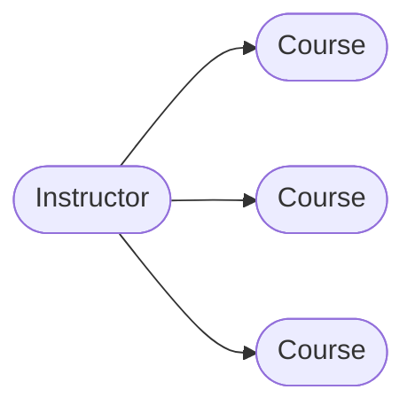
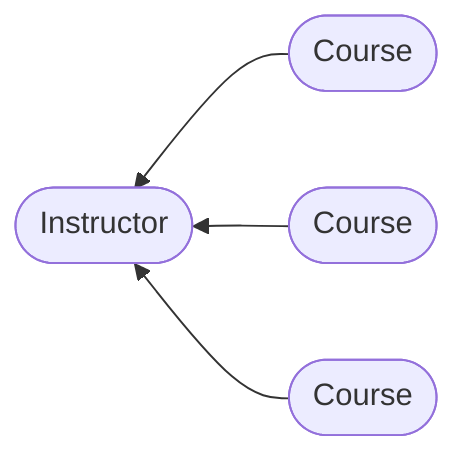

## Hibernate Mapping - oneToMany Bi-Directional

<hr>

### One to Many Mappings


<hr>

### Many to One Mappins


<hr>

### Cascading
- Do not apply cascading deletes
  - if you delete instructor, do not delete course
  - if you delete course, do not delete instructor
<hr>

### Development process: One To Many
1. Prep work- Define database tables
2. Create Course class
*course db*
    ```mermaid
    erDiagram
        instructor ||--o{ course : teach
        course{
            int id PK 
            string title
            int instructor_id  FK
        }
        instructor{
            int id PK 
            string firstName
            string lastName
            string email
            int instructor_detail_id FK
        }
    ```
    *Course.java*
    ```java
    import entity.Instructor;import javax.persistence.*;
    
    @Entity
    @Table(name = "course")
    public class Course {
        @Id
        @GeneratedValue(strategy = GenerationType.IDENTITY)
        @Column(name = "id")
        private int id;
        
        @Column(name = "title")
        private String title;
   
        @ManyToOne(cascade = {
                    CascadeType.DETACH, CascadeType.MERGE, CascadeType.PERSIST, CascadeType.REFRESH
        })
        @JoinColumn(name = "instructor_id")
        private Instructor instructor;
    }
    ```
   
3. Update Instructor class
- add annotation @OneToMany
- Add convenience method for bi-directional

    ```java
    import javax.persistence.CascadeType;
    import javax.persistence.Entity;
    import javax.persistence.OneToMany;
    import javax.persistence.Table;
    import java.util.ArrayList;
    import java.util.List;
    
    @Entity
    @Table(name = "instructor")
    public class Instructor {
        //...
        @OneToMany(mappedBy = "instructor",
                cascade = {
                        CascadeType.DETACH, CascadeType.MERGE, CascadeType.PERSIST, CascadeType.REFRESH
                })
        private List<Course> courses;
        //set get method
    
        public void add(Course tempCourse) {
            if (courses == null) {
                courses = new ArrayList<>();
            }
            
            courses.add(tempCourse);
            
            tempCourse.setInstructor(this);
        }
        //...
    }
    ```
4. Create Main App
    ```
    public static void main(String[]args){
        int theId = 1;
        
        //get the Instructor object
        Instructor tempInstructor = session.get(Instructor.class, theId);
        
        //print instructor
        System.out.println("tempInstructor: "+tempInstructor);
        
        //print the associated courses
        System.out.println("courses: "+tempInstructor.getCourses());
    }
    ```
<hr>