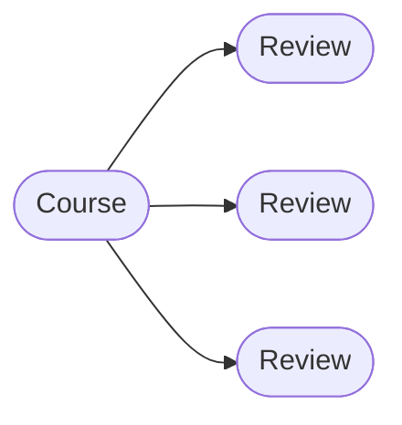
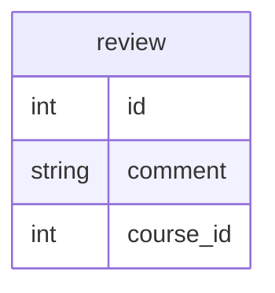

## Hibernate Mapping - One to Many Mapping Unidirectional Mapping

### Overview
- A course can have many reviews
  - Uni Directional


### Development Process: One-to-Many
1. Prep Work - Define database tables
2. Create Review class

*review db*

*Review java class*

```java
import javax.persistence.*;

@Entity
@Table(name = "review")
public class Review {

  @Id
  @GeneratedValue(strategy = GenerationType.IDENTITY)
  @Column(name = "id")
  private int id;
  
  @Column(name = "comment")
  private String comment;
}
```

3. Update Course class

```java
import javax.persistence.*;
import java.util.ArrayList;
import java.util.List;

@Entity
@Table(name = "course")
public class Course {
  @OneToMany(fetch = FetchType.LAZY, cascade = CascadeType.ALL)
  @JoinColumn(name = "course_id")
  private List<Review> reviews;
}

  ///...
  public void add(Review tempReview) {
    if (reviews == null) {
      tempReview = new ArrayList<>();
    }
    reviews.add(tempReview);
  }
```
4. Create Main App
```
  public static void main(String[] args){
  
    // get the course object
    int theId = 10;
    Course tempCourse = session.get(Course.class, theId);
    
    //print the course
    System.out.println("tempCourse: "+tempCourse);
    
    // print the associated reviews
    System.out.println("reviews: "+tempCourse.getReviews());
  }
```